# SprayWall

**El tablón digital de bloques de nuestros muros de presas.**

[spraywall.nekoescalada.com](https://spraywall.nekoescalada.com)

> Este es el texto del manual del equipo. La versión que lee la gente está en el Google Doc
> `SprayWall` de la carpeta `SpraywallNeko` de Drive; las capturas están en `manual/capturas/`.

## Qué es

Sobre la foto de cada muro se marcan las presas de un bloque, se publica, y cualquiera puede verlo,
escalarlo y apuntar que lo ha encadenado. Sirve para que un bloque bien montado no se pierda en
cuanto lo desmonta la siguiente persona que se pone a probar.

Funciona en el móvil desde el navegador. No hay que descargar nada de Google Play.

## 1. Entrar

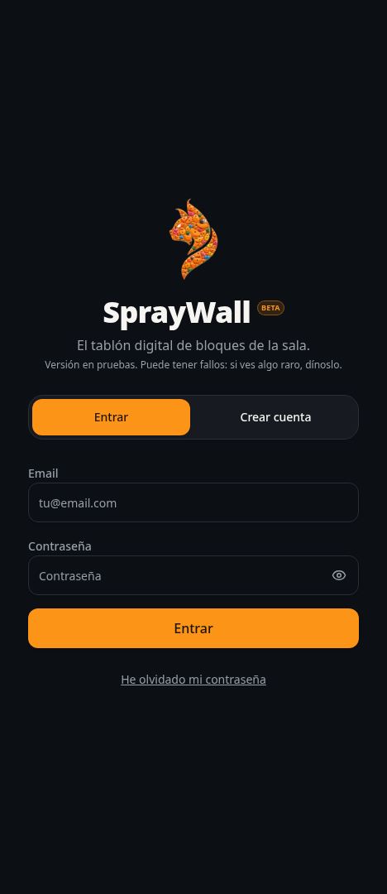

Se entra con **email y contraseña**. Creas la cuenta una vez, en «Crear cuenta», y a partir de ahí
entras desde cualquier móvil.

**Si ya usabas la app antes de que hubiera cuentas**, al registrarte escribe **exactamente el mismo
nombre** que usabas entonces: la app enlaza tu perfil de siempre y recuperas tus encadenes y tus
bloques. La propia pantalla te avisa de lo que vas a recuperar antes de crear la cuenta.

¿Olvidaste la contraseña? En la pantalla de acceso, «He olvidado mi contraseña»: te llega un email
con un enlace para poner una nueva. También puedes cambiarla desde **Mi progreso → Cambiar
contraseña**.

Todos empiezan como **alumno**. El rol de **entrenador** lo da el administrador de la sala desde la
propia app. Ya no hay código de sala.

## 2. Instalarla en el móvil

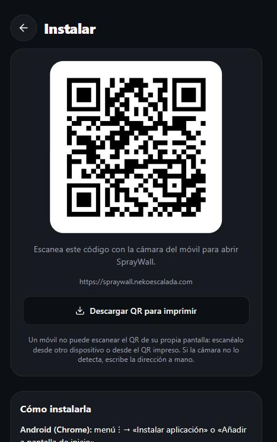

Merece la pena instalarla: se abre a pantalla completa, sin la barra del navegador, y guarda las
fotos de los muros para que carguen rápido incluso con mala cobertura dentro de la sala.

Tres formas, la que te resulte más cómoda:

- Escanea el QR de **Mi progreso → Instalar** con la cámara.
- Pulsa «Instalar» en el aviso que sale arriba en la pantalla de Muros.
- A mano: menú del navegador (⋮) → Instalar aplicación. En iPhone: Compartir → Añadir a pantalla de
  inicio.

Ahí tienes también **Descargar QR para imprimir**, que baja el código en grande y preparado para
papel: imprímelo y cuélgalo junto al muro. No recortes el borde blanco, porque es lo que permite a
las cámaras leerlo.

Una confusión habitual: **no se puede escanear el QR con el mismo móvil que lo está mostrando**.
Hazlo desde otro móvil o desde el QR impreso. Y si tu cámara no detecta códigos QR, escribe la
dirección a mano.

## 3. Los muros

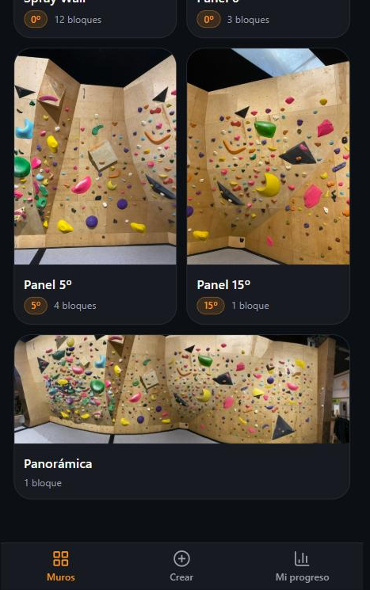

Hay cinco: **Spray Wall**, **Panel 0º**, **Panel 5º**, **Panel 15º** y la **Panorámica** de toda la
sala. Cada tarjeta indica la inclinación y cuántos bloques tiene puestos.

La Panorámica es distinta: es una foto de la sala entera, así que ocupa el ancho completo y no lleva
inclinación. Sirve para montar bloques que cruzan de un panel a otro, y para situarse.

## 4. Ver un bloque

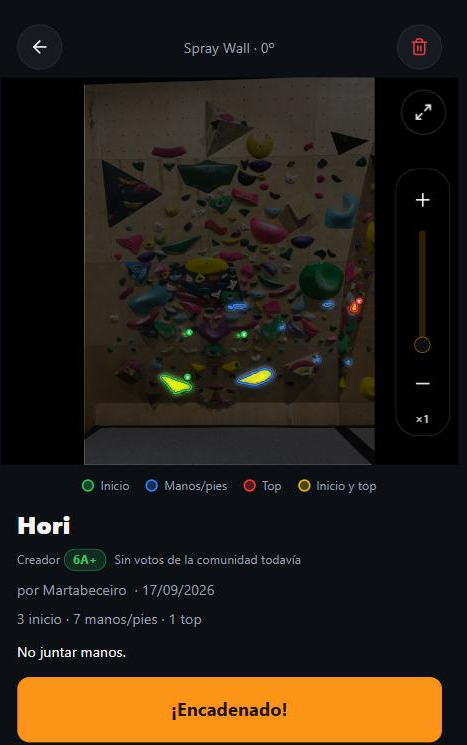

**Las presas del bloque se iluminan y el resto del muro se apaga.** Cada presa lleva alrededor la
silueta de su propia forma, con un aro de color y un resplandor, así que la presa se ve entera, sin
nada que la tape.

- **Verde:** presas de inicio.
- **Azul:** manos y pies.
- **Rojo:** el top.
- **Verde y rojo a la vez:** la misma presa sirve de inicio y de top, para las travesías circulares.

Si el bloque está numerado, cada presa lleva su número de orden en el disquito pegado al aro. Si no
lo está, solo se marcan el inicio y el top con una **I** y una **T**, y el orden lo eliges tú.

**Zoom:** pinza con dos dedos, doble toque, o la barra con **+** y **−** que hay a la derecha de la
foto. Con un dedo arrastras para moverte por el muro. El botón de la esquina (⤢) abre la foto a
pantalla completa, que es como mejor se ve delante del muro; el botón «atrás» del móvil la cierra.

Cuando lo hagas, pulsa **¡Encadenado!**. Queda guardado en Mi progreso y suma en el recuento del
bloque. Si te lo apuntaste por error, vuelve a pulsarlo y confirma.

### La Panorámica, al abrir un bloque

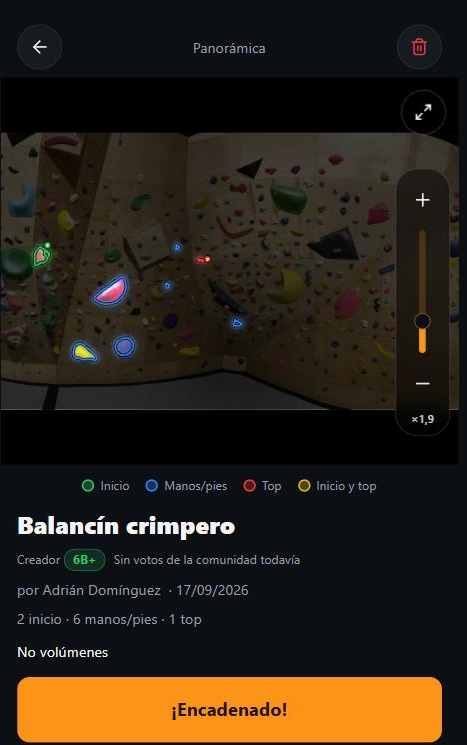

En la Panorámica, al abrir un bloque **la app encuadra sola su zona de la pared**, con margen
alrededor para que veas dónde está. Desde ahí puedes alejar para situarte en la sala o acercarte
hasta las presas.

## 5. El grado lo decide la comunidad

Quien monta el bloque le pone un grado, y puede cambiarlo cuando quiera desde la ficha del bloque,
con el lapicero pequeño junto a la pastilla «Creador». Ese grado es suyo y no lo toca nadie más.

**Si has encadenado el bloque, puedes proponer el grado que tú le darías.** El grado de la comunidad
es la **mediana** de esas propuestas, es decir el valor de en medio, así que una propuesta muy
exagerada no descuadra el resultado. El creador no vota el suyo, y si deshaces tu encadene también
se retira tu propuesta.

## 6. Buscar un bloque a tu medida

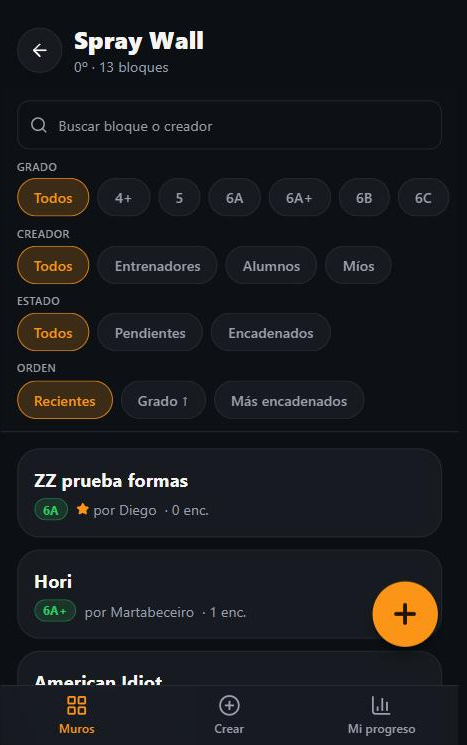

En cada muro puedes buscar por nombre del bloque o de quien lo montó, y filtrar por **grado**, por
**creador** (todos, entrenadores, alumnos o los tuyos), por **estado** (pendientes o encadenados) y
ordenar por recientes, por grado o por los más encadenados.

Los bloques puestos por un entrenador llevan una estrella al lado del nombre.

## 7. Montar un bloque

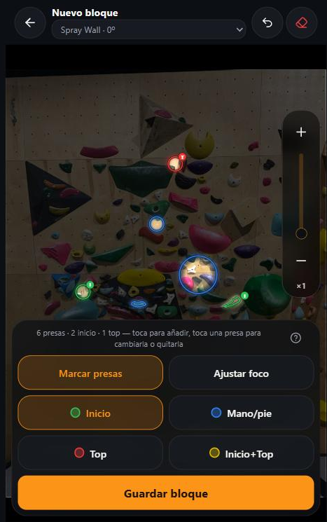

1. Pulsa **Crear** en la barra de abajo y elige el muro.
2. Elige el pincel (**Inicio**, **Mano/pie**, **Top** o **Inicio+Top**) y ve tocando las presas.
3. Pulsa **Guardar bloque** y rellena la ficha.

Para corregir: toca una presa ya marcada con otro pincel y cambia de tipo; tócala con el mismo
pincel y se quita. Arriba a la derecha tienes **deshacer** el último paso y una **goma** para
limpiar todas las presas.

**Haz zoom antes de marcar**: así aciertas la presa a la primera. No te preocupes por marcar sin
querer mientras haces zoom o arrastras: solo cuenta como toque si el dedo no se ha movido.

### Ajustar el foco de una presa

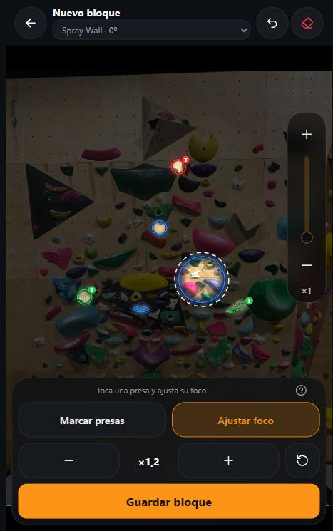

La luz de cada presa se detecta sola sobre la foto, y casi siempre acierta, pero no siempre. Cambia
a **«Ajustar foco»**, toca la presa y agranda o encoge su luz con **−** y **+**. En ese modo, tocar
una presa no la borra ni le cambia el tipo: solo la selecciona, y se marca con un aro blanco
discontinuo.

Esto importa más de lo que parece: **la silueta que tú dejas al guardar es la que verán todos los
demás**. Antes cada móvil la calculaba por su cuenta; ahora se guarda con el bloque.

### La ficha del bloque

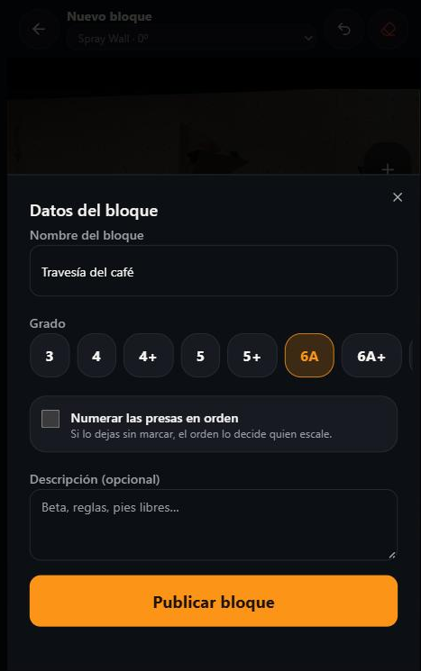

Nombre, grado y una descripción opcional (beta, reglas, pies libres…). El check **«Numerar las
presas en orden»** viene apagado a propósito, porque normalmente el orden lo decide quien escala;
puedes cambiarlo después editando el bloque.

Todo bloque necesita **al menos una presa de inicio y una de top**. Una presa Inicio+Top cuenta como
las dos.

## 8. Tu progreso

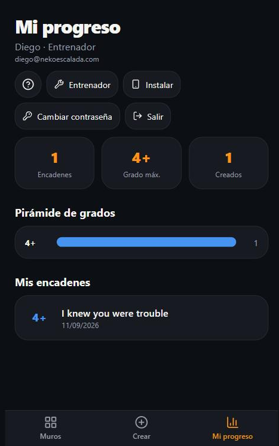

Encadenes totales, tu grado máximo, los bloques que has montado, una pirámide de grados y el
historial con fechas. Desde aquí se llega también a **Instalar**, a **Cambiar contraseña** y, si
eres entrenador, al **panel de entrenador**.

## 9. La ayuda dentro de la app

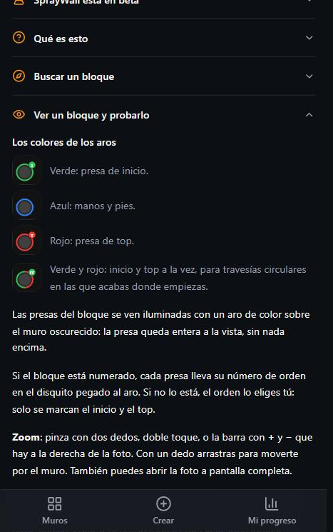

La app lleva su propia guía en el icono **?** de la pantalla de Muros, en la cabecera de Mi progreso
y junto a los pinceles del editor. Ahí está todo esto explicado en corto y siempre al día.

## 10. Entrenadores: cambiar la foto de un muro

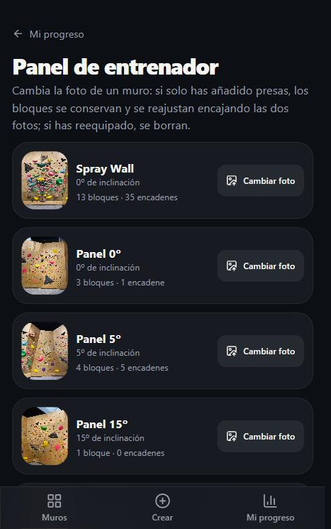

En **Mi progreso → Entrenador**. Al elegir la foto, la app pregunta **qué ha cambiado en el muro**,
porque la respuesta decide qué pasa con los bloques que ya existen:

- **«Solo he añadido presas»** — el muro es el mismo, solo hay presas nuevas. **No se borra nada.**
  Se abre una pantalla donde la foto antigua queda superpuesta a la nueva y se arrastra, escala y
  gira con los dedos hasta que las presas coinciden; el botón **Diferencia** pone la imagen casi
  negra cuando encajan, que es la forma más rápida de acertar. Al confirmar, las presas de todos los
  bloques se recolocan sobre la foto nueva. Si a algún bloque se le sale una presa del encuadre, ese
  bloque se queda dibujado sobre la foto de antes. Y mientras haya un reajuste reciente, el muro
  ofrece **Deshacer reajuste**.
- **«He reequipado el muro»** — las presas son otras. Este camino **borra los bloques de ese muro y
  sus encadenes**, y no se puede deshacer. La app dice cuántos se van a perder y pide escribir
  `BORRAR` para confirmar.

Para la foto: **siempre desde el mismo sitio**, de frente y a la misma distancia, con todo el panel
dentro del encuadre y luz uniforme. Cuanto más se parezca al encuadre anterior, menos hay que
ajustar. Puedes hacerla con el móvil en ese momento: la app la coloca sola y no sale tumbada.

Si eres administrador, desde ese mismo panel puedes **dar y quitar el rol de entrenador**.

## Alumno y entrenador: qué cambia

Los dos pueden montar bloques, encadenar, filtrar, proponer grado y llevar su progreso. Las
diferencias:

- **Editar un bloque es solo de quien lo montó**, sea alumno o entrenador.
- **Borrar** puede hacerlo el creador, cualquier entrenador y el administrador. Es la forma de
  limpiar el bloque de alguien que ya no viene.
- Los bloques de entrenador salen con una estrella.
- Solo los entrenadores cambian la foto de un muro.

## Cosas que conviene saber

- **Antes de reequipar un muro, avisad.** Si solo se añaden presas, los bloques se conservan
  reajustándolos; si se reequipa de verdad, se pierden.
- Los bloques van **sin numerar** por defecto, y entonces el orden lo decide quien escala. Si marcas
  la casilla de numerar, el orden es el orden en que marcaste las presas.
- **La app está en beta.** Funciona y los datos no se borran por serlo, pero puede tener fallos y va
  cambiando. Si ves algo raro, dilo.

*Dudas, fallos o ideas: habla con Diego.*
